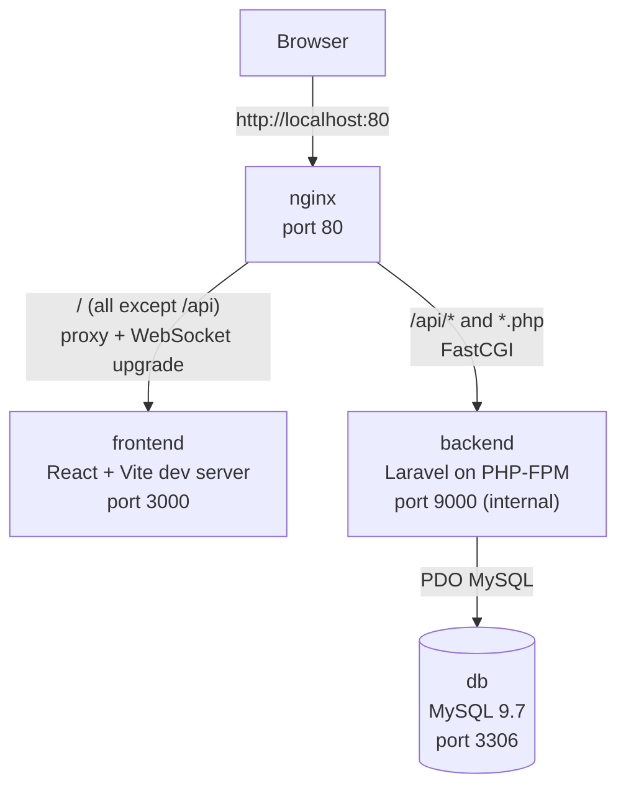
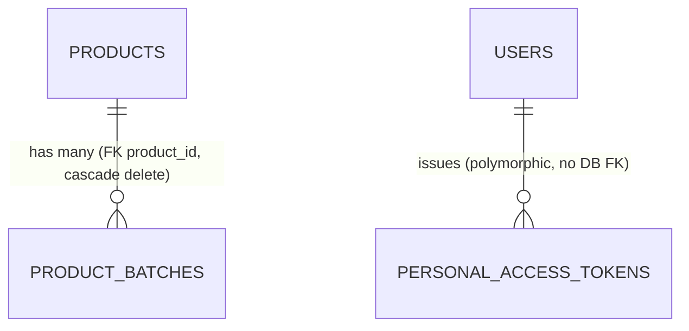

# Walang Brownout Appliances

A real-time, web-based inventory management system for Walang Brownout Appliances, built with React, Laravel, and MySQL to address seasonal shortages, apply FIFO stock handling, and automate Reorder Point (ROP) alerts.

> **Status: early development.** The Laravel API (authentication, products, product batches) and the Docker environment work. The React frontend is a UI prototype on mock data and is **not yet connected to the API**. FIFO, ROP alerts, stock movements, and reports are **planned, not implemented**.

## Table of Contents

1. [Overview](#overview)
2. [Features and Status](#features-and-status)
3. [Architecture](#architecture)
4. [Tech Stack](#tech-stack)
5. [Repository Structure](#repository-structure)
6. [Getting Started](#getting-started)
7. [Makefile Commands](#makefile-commands)
8. [Database](#database)
9. [API Reference](#api-reference)
10. [Authentication](#authentication)
11. [Frontend](#frontend)
12. [Inventory Logic](#inventory-logic)
13. [Testing](#testing)
14. [Git Workflow](#git-workflow)
15. [Troubleshooting](#troubleshooting)
16. [Security Notes](#security-notes)
17. [Known Issues](#known-issues)
18. [Roadmap](#roadmap)
19. [Contributors and License](#contributors-and-license)

## Overview

Walang Brownout Appliances sells appliances such as air conditioners, air purifiers, and filters, whose demand rises sharply in some seasons. This system is meant to give the business one place to see what is in stock, which batch it came from, when it expires, and when to reorder.

The project's stated goals are to solve **seasonal shortages**, enforce **FIFO**, and automate **Reorder Point (ROP) alerts**. The data model already has the fields these need; the logic itself is not written yet (see [Inventory Logic](#inventory-logic)).

## Features and Status

 Implemented ·  In development / partial ·  Planned

| Component | Status | Notes |
| --- | --- | --- |
| Docker environment |  | 4 services (MySQL, PHP-FPM, Nginx, Vite). Development only; no production config. |
| Authentication API |  | Register, login, logout, current user (Sanctum bearer tokens). |
| Product CRUD API |  | `/api/products` with validation; responses include batches. |
| Product batch CRUD API |  | `/api/product-batches` with validation; responses include the product. |
| Frontend UI |  | Role selection, 2 login screens, manager dashboard, inventory list, add product, product details. Mock data and `localStorage` only. |
| Frontend login |  | Form checks only; no API call, token storage, or route guard. |
| ROP / safety stock / ABC / expiry |  | Stored as fields only; no calculations or alerts. |
| FIFO |  | Batch fields exist; no allocation logic. |
| Stock movement (receive/dispatch) |  | No table, model, or endpoint. |
| Reports, user management |  | Sidebar links only; no pages or endpoints. |
| Real-time updates |  | Not implemented (`BROADCAST_CONNECTION=log` in `.env.example`). |
| Automated tests |  | Default Laravel example tests only. |

## Architecture



| Service | Image / build | Host port | Role |
| --- | --- | --- | --- |
| `nginx` | `nginx:alpine` | 80 | Single entry point; routes `/api` to PHP-FPM and everything else to the frontend |
| `frontend` | `node:20-alpine` (`frontend/DOCKERFILE`) | 3000 | Vite dev server |
| `backend` | `php:8.4-fpm` (`docker/php/DOCKERFILE`) | none (9000 internal) | Laravel API |
| `db` | `mysql:9.7` | 3306 | Database |

All services share the `app-network` bridge network. `./backend` and `./frontend` are bind-mounted for live editing. There is no MySQL data volume and no health check.

## Tech Stack

Versions are the ranges declared in `composer.json`, `package.json`, and Docker files.

| Layer | Technology | Version |
| --- | --- | --- |
| Frontend | React, React DOM | ^19.2.8 |
| Routing | react-router | ^8.3.0 |
| Build tool | Vite, @vitejs/plugin-react | ^8.2.0, ^6.0.4 |
| Styling | Tailwind CSS 4, FlyonUI | ^4.3.3, ^2.4.1 |
| Linting | oxlint | ^1.7.5 |
| Backend | Laravel, PHP | ^13.8, ^8.3 (image `php:8.4-fpm`) |
| API auth | Laravel Sanctum | ^4.0 |
| Testing | PHPUnit | ^12.5.12 |
| Database | MySQL | 9.7 |
| Web server / containers | Nginx, Docker Compose | `nginx:alpine` |
| Frontend runtime | Node.js | 20 |

## Repository Structure

```text
WalangBrownout/
├── backend/                  # Laravel API
│   ├── app/Http/Controllers/ # AuthController, ProductController, ProductBatchController
│   ├── app/Models/           # User, Product, ProductBatch
│   ├── database/migrations/  # Schema
│   ├── routes/api.php        # API routes
│   ├── tests/                # Default example tests
│   └── .env.example
├── frontend/                 # React + Vite app
│   ├── src/App.jsx           # Route table
│   ├── src/api/auth.js       # login() helper (unused by pages so far)
│   └── src/pages/            # Screens
├── docker/
│   ├── nginx/default.conf    # Routing rules
│   └── php/DOCKERFILE
├── docker-compose.yml
├── Makefile
└── package.json              # Root Tailwind/FlyonUI dependencies
```

## Getting Started

**Prerequisites:** Git and Docker with Docker Compose (Docker Desktop on Windows/macOS). GNU Make is optional. PHP, Composer, and Node.js run inside the containers, so you do not need them installed.

```bash
git clone https://github.com/reiy-git/WalangBrownout.git
cd WalangBrownout
```

**1. Create the backend environment file** (`backend/.env` is git-ignored):

```bash
cp backend/.env.example backend/.env      # PowerShell: Copy-Item backend/.env.example backend/.env
```

`.env.example` defaults to SQLite. To use the MySQL container, set these in `backend/.env`, using the values from the `db` service in `docker-compose.yml`:

```dotenv
DB_CONNECTION=mysql
DB_HOST=db
DB_PORT=3306
DB_DATABASE=app_db
DB_USERNAME=app_user
DB_PASSWORD=<MYSQL_PASSWORD value from docker-compose.yml>
```

`DB_HOST` must be `db` (the service name), not `127.0.0.1`.

**2. Start the containers and verify:**

```bash
docker compose up -d --build
docker compose ps
```

**3. Install backend dependencies, generate the key, and migrate** (`backend/vendor/` is git-ignored):

```bash
docker compose exec backend composer install
docker compose exec backend php artisan key:generate
docker compose exec backend php artisan migrate
docker compose exec backend php artisan db:seed     # optional: creates a test user (see DatabaseSeeder.php)
```

The frontend installs its dependencies at image build time and starts the Vite dev server automatically.

**4. Open the app:** <http://localhost> (recommended, API at <http://localhost/api>). Port 3000 serves the frontend only; it does not proxy `/api`.

## Makefile Commands

| Command | Purpose |
| --- | --- |
| `make setup` | `up -d --build`, then `key:generate`, then `migrate` (does **not** create `.env` or run `composer install`; do those first) |
| `make up` / `make down` | Start / stop containers |
| `make restart` | `down`, then `up -d --build` |
| `make logs` | Follow logs for all services |
| `make backend-shell` / `make frontend-shell` | Open a shell in the backend (`bash`) / frontend (`sh`) container |
| `make migrate` | Run `php artisan migrate` |

## Database

Migrations create these tables: `users`, `password_reset_tokens`, `sessions`, `cache`, `cache_locks`, `jobs`, `job_batches`, `failed_jobs`, `personal_access_tokens` (Sanctum), `products`, and `product_batches`. The application tables are below; the rest are standard Laravel framework tables.

**`products`** (PK `id`, unsigned int)

| Field | Type | Notes |
| --- | --- | --- |
| `sku` | varchar(50) | Unique via API validation only (no DB index) |
| `name` | varchar(255) | |
| `unit_cost` | decimal(10,2) | |
| `abc_category` | enum `A`, `B`, `C` | |
| `expiry_months` | int | |
| `reorder_point` | int | |
| `safety_stock` | int | |
| `annual_demand` | decimal(10,2) | |
| `last_reorder_date` | date, nullable | |
| `created_at`, `updated_at` | timestamps | |

**`product_batches`** (PK `id`, unsigned int; FK `product_id` → `products.id`, `ON DELETE CASCADE`)

| Field | Type | Notes |
| --- | --- | --- |
| `product_id` | unsigned int | Parent product |
| `batch_number` | varchar(100) | |
| `date_received` | date | |
| `quantity_received` | int | |
| `quantity_remaining` | int | |
| `expiry_date` | date | |
| `status` | enum `active`, `depleted`, `expired` | Set by the client; not derived automatically |
| `created_at`, `updated_at` | timestamps | |

**`users`**: `id`, `name`, `email` (unique), `email_verified_at`, `password` (hashed), `remember_token`, timestamps.



## API Reference

Base URL: `http://localhost/api`. Send `Accept: application/json`. Protected routes need `Authorization: Bearer <token>`. Errors under `/api` are always JSON; validation failures return 422.

| Method | Endpoint | Auth | Purpose |
| --- | --- | --- | --- |
| POST | `/register` | No | Create user, returns `user` and `token` (201) |
| POST | `/login` | No | Returns `user` and `token`; 401 on bad credentials |
| POST | `/logout` | Yes | Revoke the current token |
| GET | `/user` | Yes | Authenticated user |
| GET | `/products` | Yes | List products with `batches` (not paginated) |
| POST | `/products` | Yes | Create product (201) |
| GET | `/products/{product}` | Yes | Show product with `batches` |
| PUT/PATCH | `/products/{product}` | Yes | Update product |
| DELETE | `/products/{product}` | Yes | Delete product (batches cascade) |
| GET | `/product-batches` | Yes | List batches with `product` (not paginated) |
| POST | `/product-batches` | Yes | Create batch (201) |
| GET | `/product-batches/{product_batch}` | Yes | Show batch with `product` |
| PUT/PATCH | `/product-batches/{product_batch}` | Yes | Update batch |
| DELETE | `/product-batches/{product_batch}` | Yes | Delete batch |

**Validation rules**

| Endpoint | Rules |
| --- | --- |
| `POST /register` | `name` required string; `email` required, valid, unique; `password` required, min 8 |
| `POST /login` | `email` required, valid; `password` required |
| `POST /products` | `sku` required, max 50, unique; `name` required, max 255; `unit_cost` numeric ≥ 0; `abc_category` in `A,B,C`; `expiry_months`, `reorder_point`, `safety_stock` integer ≥ 0; `annual_demand` numeric ≥ 0; `last_reorder_date` optional date |
| `POST /product-batches` | `product_id` must exist; `batch_number` required, max 100; `date_received` and `expiry_date` dates; `quantity_received` and `quantity_remaining` integer ≥ 0; `status` in `active,depleted,expired` |
| `PUT/PATCH` (both) | Same fields, each optional (`sometimes`); SKU uniqueness ignores the current record |

The API does not check that `quantity_remaining` ≤ `quantity_received` or that `expiry_date` is after `date_received`.

**Quick manual test** (replace placeholders; never commit real tokens):

```bash
# 1. Register or log in, and copy the token from the response
curl -X POST http://localhost/api/login -H "Accept: application/json" -H "Content-Type: application/json" \
  -d '{"email":"you@example.com","password":"<your-password>"}'

# 2. Create a product, then use its id as product_id when creating a batch
curl -X POST http://localhost/api/products -H "Accept: application/json" -H "Content-Type: application/json" \
  -H "Authorization: Bearer <token>" \
  -d '{"sku":"AC-001","name":"Air Condition Split Type","unit_cost":25000,"abc_category":"A","expiry_months":24,"reorder_point":10,"safety_stock":5,"annual_demand":120}'
```

## Authentication

The backend uses **Laravel Sanctum personal access tokens** (bearer tokens), not cookie sessions. Register and login each create a token named `auth_token` and return it once. Product, batch, logout, and user routes sit behind `auth:sanctum`. Logout deletes only the token used for that request. Tokens do not expire by default (`expiration` is `null` in `config/sanctum.php`). Passwords are hashed by the `User` model's `hashed` cast and checked with `Hash::check`.

## Frontend

React 19 + `react-router`, styled with Tailwind 4 and FlyonUI. State is local component state; there is no global store.

| Path | Page | Notes |
| --- | --- | --- |
| `/` | `LoginRoleSelection` | Manager goes to `/manager-login`, other role to `/login` |
| `/login` | `StaffLogin` | See [Known Issues](#known-issues) |
| `/manager-login` | `LoginPage` | Navigates to the dashboard without calling the API |
| `/manager-dashboard` | `ManagerDashboard` | Hard-coded summary cards and "Recent Transactions" |
| `/inventory-list` | `ManagerInventoryList` | Search and category/status filters; mock plus `localStorage` products |
| `/manager-inventory-add-product` | `ManagerInventoryAddProduct` | Name, category, stock, reorder point, price, description, image preview; saves to `localStorage` key `customProducts` |
| `/product-details/:name` | `ManagerProductDetails` | Category, stock, reorder point, price, description |

`src/api/auth.js` exports `login()` (uses `VITE_API_BASE_URL` or `/api`) but no page imports it. `Dashboard.jsx`, `InventoryList.jsx`, and `StaffDashboard.jsx` exist but are not routed. The sidebar links to `/reorder-points`, `/users`, and `/reports`, which have no pages.

## Inventory Logic

What the code actually does today:

| Concept | Status | Reality |
| --- | --- | --- |
| FIFO |  Planned | No logic. `date_received` and `quantity_remaining` are the data it would use. |
| Reorder Point |  Data only | `reorder_point` and `last_reorder_date` are stored. No backend calculation or alert. The add-product form labels stock client-side: above the reorder point is "In stock", above zero is "Low Stock", otherwise "Out Of Stock". |
| Safety stock, annual demand |  Data only | Stored and validated; unused in calculations. |
| ABC category |  Data only | Accepts `A`/`B`/`C`; meaning is not defined in the repository. |
| Expiration |  Data only | `expiry_months`, `expiry_date`, and batch `status` are stored; nothing updates status or flags upcoming expiry. |
| Stock movement |  Planned | No table, model, or endpoint. |

## Testing

- **PHPUnit:** configured (in-memory SQLite) but only the two default example tests exist. Run: `docker compose exec backend php artisan test`.
- **Frontend:** no tests. Lint with `docker compose exec frontend npm run lint`.
- **API / end-to-end tests:** none. The API is verified manually with an HTTP client (curl, Postman, Thunder Client).

## Git Workflow

```text
main  ←  develop  ←  feature/<feature-name>
```

- **`main`**: production branch.
- **`develop`**: shared integration branch.
- **`feature/*`**: one branch per task, created from `develop`. **Pull Requests target `develop`, not `main`.**

```bash
git checkout develop
git pull origin develop
git checkout -b feature/<feature-name>
# ...work and test locally...
git add .
git commit -m "feat: <description>"
git push origin feature/<feature-name>
```

Then open a Pull Request into `develop`, request a review, address comments, and merge once approved.

**Commit prefixes:** `feat:` new feature · `fix:` bug fix · `docs:` documentation · `refactor:` restructuring without behavior change · `test:` tests · `chore:` maintenance such as dependency updates.

## Troubleshooting

| Problem | What to do |
| --- | --- |
| **Port 3306 in use** | Find the process: `Get-NetTCPConnection -LocalPort 3306` then `Get-Process -Id <OwningProcess>`. If it is the local Windows MySQL service, confirm with `Get-Service MySQL80` and, only if it is the conflict and you do not need it, run `Stop-Service MySQL80` (admin PowerShell). Or change the host port in `docker-compose.yml` (e.g. `"3307:3306"`). Ports 80 and 3000 can conflict the same way. |
| **`vendor/autoload.php` not found** | `docker compose exec backend composer install` |
| **No application encryption key** | `docker compose exec backend php artisan key:generate` |
| **DB connection refused / wrong DB** | Check `backend/.env` has `DB_CONNECTION=mysql` and `DB_HOST=db`; then `php artisan config:clear` in the backend container. |
| **Migrate fails right after startup** | MySQL may still be initializing (no health check). Wait a few seconds and retry. |
| **Changed `frontend/package.json`** | Rebuild: `docker compose up -d --build frontend` (the container keeps its own `node_modules`). |
| **`lucide-react` import error** | Used by unrouted files but not declared in `frontend/package.json`; add it if you start using them. |
| **API calls fail** | Browse via `http://localhost`, not `:3000`; the Vite config has no proxy. |
| **Check containers** | `docker compose ps`, `docker compose logs -f <service>` (or `make logs`). |

## Security Notes

Present: Sanctum token auth on protected routes, hashed passwords, inline input validation, `$fillable` mass-assignment protection, and `backend/.env` / `.env` in `.gitignore`.

Be aware (not verified as secure):

- Never commit `.env` files, passwords, tokens, or credentials.
- `docker-compose.yml` contains plain-text development database passwords; move them to environment files before any shared or production use.
- There are no roles or permissions on the API: any authenticated user can create, edit, and delete products and batches. The manager/staff screens are not tied to backend roles.
- `POST /api/register` is public, tokens do not expire, and `.env.example` sets `APP_DEBUG=true` (development only).
- `.vscode/mcp.json` prompts for a FlyonUI license key at runtime; do not paste the key into the file.

## Known Issues

1. The frontend does not call the API; login screens navigate to the dashboard without authenticating.
2. `StaffLogin.jsx` calls `navigate(...)` without importing or defining it, so submitting that form should throw an error.
3. The add-product form fields (name, category, stock, price, ...) do not match the API's product fields (`sku`, `abc_category`, `unit_cost`, ...), and stock is per product in the UI but per batch in the database.
4. `make setup` is incomplete on a fresh clone (no `.env`, no `composer install`), and `.env.example` targets SQLite while Docker provides MySQL.
5. A root-level `node_modules/` appears in the repository; the root `.gitignore` only ignores `/frontend/node_modules`.
6. `sku` uniqueness is enforced only in validation, not by a database index.
7. `frontend/README.md` and `backend/README.md` are the default Vite and Laravel template READMEs.

## Roadmap

**Completed:** Docker environment; Sanctum auth API; product and batch CRUD API; migrations; frontend prototype screens.

**In progress:** connecting the frontend to the API.

**Planned:** token storage and route protection in the frontend; align the product form with the API fields; batch screens; FIFO allocation; ROP calculation and alerts; expiry monitoring; stock movement records; reports and user management; real-time visibility; automated tests; production build and deployment configuration.

## Contributors and License

**Contributors:** Project Team · repository owner [reiy-git](https://github.com/reiy-git). Reiy Briones is the lead developer, Raissa Capistrano and Marriyell Burgos is the frontend developer, and Ron Norman Canayong and Angelo Castillo is the backend developer.

**License:** no license has been specified for this project. (The Laravel skeleton in `backend/` is MIT-licensed; that does not define this project's license.)

---


